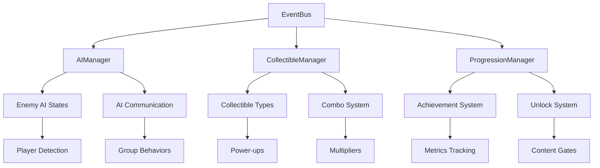

# Design Document

## Overview

The Advanced Gameplay Systems enhancement transforms the HTML5 platformer into a production-ready game through three interconnected systems: intelligent enemy AI, strategic collectible mechanics, and sophisticated progression tracking. The design emphasizes modularity, performance, and emergent gameplay while maintaining the game's core platforming feel.

The architecture leverages Godot's signal system and autoloaded singletons to create loosely coupled systems that can interact seamlessly. Each system is designed to be independently testable and configurable, allowing for easy balancing and content creation.

## Architecture

### Core System Integration



### System Dependencies

- **AIManager**: Depends on EventBus, Game, DimensionManager
- **CollectibleManager**: Depends on EventBus, Game, Audio, FX
- **ProgressionManager**: Depends on EventBus, Game, Persistence, LevelLoader
- **Enhanced Enemies**: Depend on AIManager, ObjectPool
- **Enhanced Collectibles**: Depend on CollectibleManager, ObjectPool

## Components and Interfaces

### AIManager (Autoloaded Singleton)

**Purpose**: Centralized AI coordination and state management

```gdscript
class_name AIManager
extends Node

# AI Types
enum AIType {
    PATROL,      # Basic patrol behavior (existing)
    HUNTER,      # Actively pursues player
    GUARDIAN,    # Defends territory
    SWARM        # Group coordination
}

# AI States
enum AIState {
    IDLE,
    PATROL,
    ALERT,
    PURSUE,
    SEARCH,
    RETREAT,
    COORDINATE
}

# Core Methods
func register_enemy(enemy: Node) -> void
func unregister_enemy(enemy: Node) -> void
func get_nearby_enemies(position: Vector2, radius: float) -> Array[Node]
func broadcast_alert(position: Vector2, alert_type: String) -> void
func update_ai_difficulty(level: float) -> void
```

**Key Features**:
- Enemy registration and tracking
- Spatial partitioning for performance
- Alert propagation system
- Difficulty scaling
- AI behavior coordination

### CollectibleManager (Autoloaded Singleton)

**Purpose**: Manages collectible spawning, tracking, and combo systems

```gdscript
class_name CollectibleManager
extends Node

# Collectible Types
enum CollectibleType {
    FRUIT,           # Basic points (existing)
    GEM,             # Bonus points (existing)
    POWER_UP,        # Temporary abilities
    UPGRADE_CORE,    # Permanent upgrades
    COMBO_CRYSTAL,   # Combo multipliers
    DIMENSION_KEY,   # Dimension-specific items
    SECRET_RELIC     # Hidden rare items
}

# Core Methods
func spawn_collectible(type: CollectibleType, position: Vector2, config: Dictionary) -> Node
func collect_item(collectible: Node, player: Node) -> void
func get_combo_multiplier() -> float
func reset_combo() -> void
func get_collection_progress(level: String) -> Dictionary
```

**Key Features**:
- Dynamic collectible spawning
- Combo system with multipliers
- Collection tracking per level
- Power-up effect management
- Dimension-aware collectibles

### ProgressionManager (Autoloaded Singleton)

**Purpose**: Tracks player progress, achievements, and unlocks

```gdscript
class_name ProgressionManager
extends Node

# Achievement Categories
enum AchievementType {
    COMPLETION,      # Level completion
    COLLECTION,      # Item collection
    SKILL,          # Performance-based
    EXPLORATION,    # Secret finding
    MASTERY         # Perfect runs
}

# Core Methods
func track_performance(level: String, metrics: Dictionary) -> void
func check_unlocks() -> Array[String]
func get_player_rating(level: String) -> String
func unlock_content(content_id: String) -> void
func get_progression_data() -> Dictionary
```

**Key Features**:
- Performance metrics tracking
- Achievement system
- Content unlock management
- Player skill rating
- Progress visualization

### Enhanced Enemy Base Class

```gdscript
class_name EnhancedEnemy
extends CharacterBody2D

@export var ai_type: AIManager.AIType = AIManager.AIType.PATROL
@export var detection_range: float = 120.0
@export var communication_range: float = 200.0
@export var alert_duration: float = 5.0

var ai_state: AIManager.AIState = AIManager.AIState.IDLE
var target_player: Node = null
var last_known_player_position: Vector2
var alert_timer: float = 0.0
var nearby_enemies: Array[Node] = []

# AI Behavior Methods
func enter_state(new_state: AIManager.AIState) -> void
func update_ai(delta: float) -> void
func detect_player() -> Node
func communicate_with_nearby() -> void
func pathfind_to_target(target_pos: Vector2) -> Array[Vector2]
```

### Enhanced Collectible Base Class

```gdscript
class_name EnhancedCollectible
extends Area2D

@export var collectible_type: CollectibleManager.CollectibleType
@export var points_value: int = 100
@export var combo_contribution: float = 1.0
@export var dimension_requirement: int = -1  # -1 = any dimension
@export var rarity: float = 1.0  # 0.0-1.0, affects spawn chance

var is_collected: bool = false
var spawn_effects: Array[Node] = []
var collection_effects: Array[Node] = []

# Collectible Methods
func setup_collectible(config: Dictionary) -> void
func can_be_collected(player: Node) -> bool
func trigger_collection(player: Node) -> void
func create_spawn_effect() -> void
func create_collection_effect() -> void
```

## Data Models

### AI Configuration Data

```json
{
  "ai_types": {
    "hunter": {
      "detection_range": 150.0,
      "pursuit_speed": 120.0,
      "search_duration": 3.0,
      "pathfinding_enabled": true,
      "abilities": ["jump", "wall_climb"]
    },
    "guardian": {
      "territory_radius": 100.0,
      "aggression_multiplier": 1.5,
      "return_speed": 80.0,
      "defensive_abilities": ["shield", "area_attack"]
    },
    "swarm": {
      "group_size": 3,
      "coordination_range": 150.0,
      "formation_type": "triangle",
      "shared_health": false
    }
  }
}
```

### Collectible Configuration Data

```json
{
  "collectible_types": {
    "power_up_speed": {
      "type": "POWER_UP",
      "duration": 10.0,
      "effect": "speed_boost",
      "multiplier": 1.5,
      "visual_effect": "speed_aura",
      "sound_effect": "powerup_speed"
    },
    "upgrade_double_jump": {
      "type": "UPGRADE_CORE",
      "permanent": true,
      "ability": "double_jump",
      "unlock_requirement": "collect_10_gems",
      "rarity": 0.1
    }
  }
}
```

### Progression Data Model

```json
{
  "player_progress": {
    "level_ratings": {
      "Level01": {
        "completion_time": 45.2,
        "score": 2500,
        "collectibles_found": 8,
        "total_collectibles": 10,
        "deaths": 1,
        "rating": "A",
        "unlocks_earned": ["Level02", "time_trial_Level01"]
      }
    },
    "achievements": {
      "speed_demon": {
        "unlocked": true,
        "unlock_date": "2024-01-15",
        "progress": 100
      }
    },
    "unlocked_content": [
      "Level01", "Level02", "ability_double_jump", "skin_blue"
    ]
  }
}
```

## Error Handling

### AI System Error Handling

1. **Pathfinding Failures**: Fallback to direct movement with obstacle avoidance
2. **Target Loss**: Return to patrol state with search behavior
3. **Communication Errors**: Isolate enemy AI to prevent cascade failures
4. **Performance Degradation**: Reduce AI update frequency dynamically

### Collectible System Error Handling

1. **Spawn Failures**: Log error and continue without breaking gameplay
2. **Collection Conflicts**: Use collision priority system to resolve
3. **Effect Failures**: Disable visual effects but maintain gameplay functionality
4. **Save Data Corruption**: Reset collectible progress with user notification

### Progression System Error Handling

1. **Achievement Calculation Errors**: Recalculate from base data
2. **Unlock Failures**: Maintain game state and retry on next session
3. **Data Persistence Errors**: Use backup save system
4. **Performance Tracking Errors**: Continue gameplay without metrics

## Testing Strategy

### Unit Testing

**AI System Tests**:
- State transition validation
- Detection range accuracy
- Pathfinding algorithm correctness
- Communication system reliability

**Collectible System Tests**:
- Spawn probability verification
- Combo calculation accuracy
- Effect duration timing
- Dimension requirement validation

**Progression System Tests**:
- Achievement trigger conditions
- Unlock requirement validation
- Rating calculation accuracy
- Data persistence integrity

### Integration Testing

**Cross-System Interactions**:
- AI response to collectible events
- Progression tracking during AI encounters
- Collectible effects on AI behavior
- Performance impact of combined systems

### Performance Testing

**Benchmarks**:
- 60 FPS maintenance with 20+ enemies
- Memory usage under 1GB with all systems active
- Load time impact of enhanced systems
- Mobile device compatibility

### Gameplay Testing

**Balance Validation**:
- AI difficulty progression feels fair
- Collectible rewards feel meaningful
- Progression pacing maintains engagement
- System complexity doesn't overwhelm players

## Implementation Phases

### Phase 1: Core AI Enhancement
- Implement AIManager singleton
- Create enhanced enemy base class
- Add Hunter and Guardian AI types
- Integrate with existing PatrolEnemy

### Phase 2: Advanced Collectibles
- Implement CollectibleManager singleton
- Create power-up system
- Add combo mechanics
- Integrate dimension-aware collectibles

### Phase 3: Progression System
- Implement ProgressionManager singleton
- Add achievement tracking
- Create unlock system
- Integrate performance metrics

### Phase 4: Polish and Integration
- Cross-system interaction testing
- Performance optimization
- UI integration for new features
- Mobile compatibility verification

## Performance Considerations

### Optimization Strategies

1. **Spatial Partitioning**: Use quadtree for enemy AI updates
2. **LOD System**: Reduce AI complexity for distant enemies
3. **Object Pooling**: Reuse collectible and effect objects
4. **Batch Processing**: Group similar AI updates together
5. **Async Operations**: Use coroutines for heavy calculations

### Memory Management

1. **Resource Preloading**: Load AI and collectible configurations at startup
2. **Texture Atlasing**: Combine collectible sprites into atlases
3. **Audio Pooling**: Reuse audio players for effects
4. **Data Compression**: Compress progression data for storage

### Mobile Optimization

1. **Touch-Friendly UI**: Ensure progression screens work on small screens
2. **Performance Scaling**: Automatically reduce AI complexity on slower devices
3. **Battery Optimization**: Reduce update frequencies when possible
4. **Network Efficiency**: Minimize data usage for cloud saves